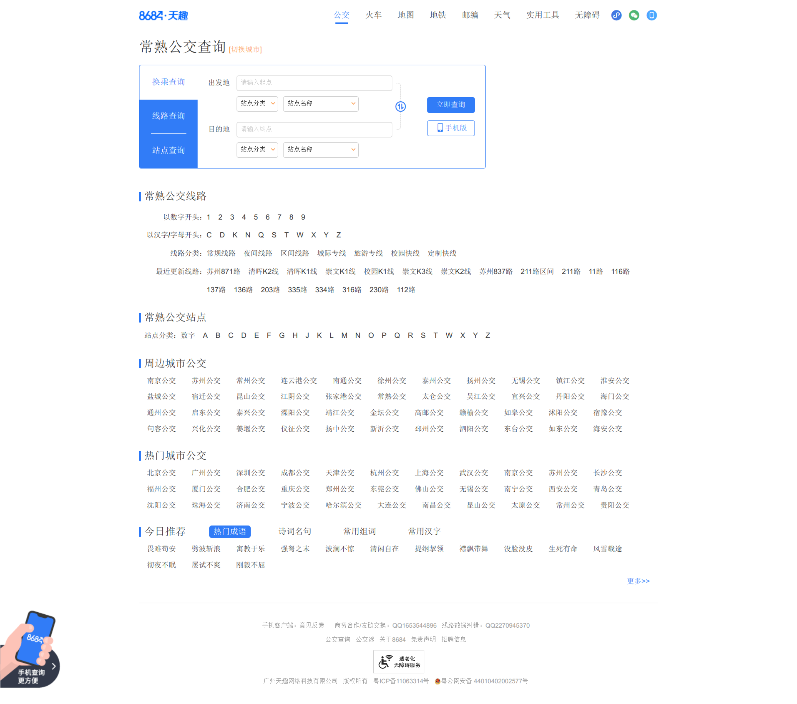
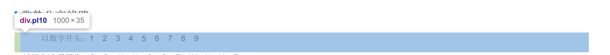
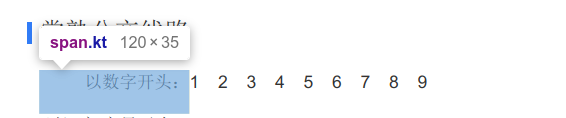
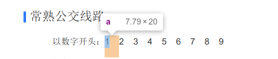
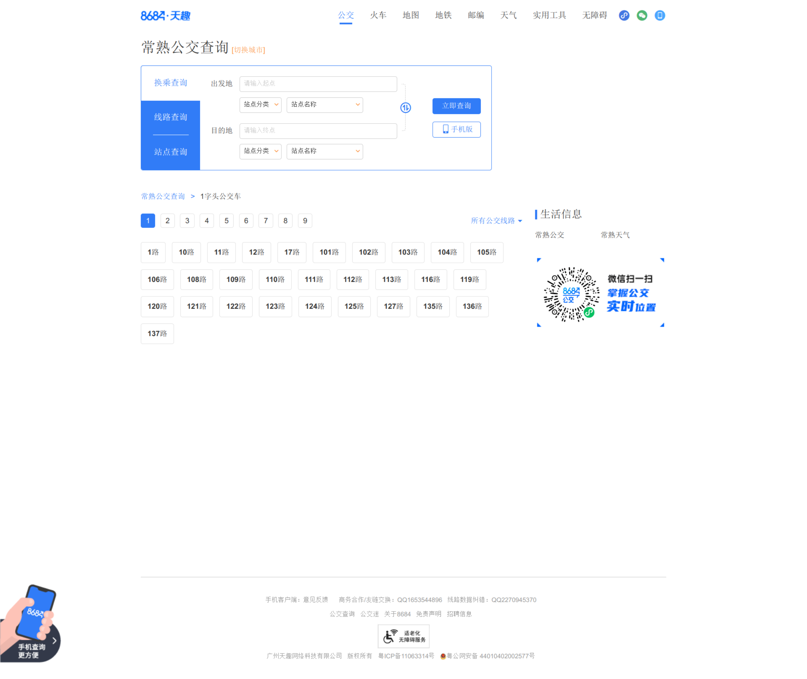
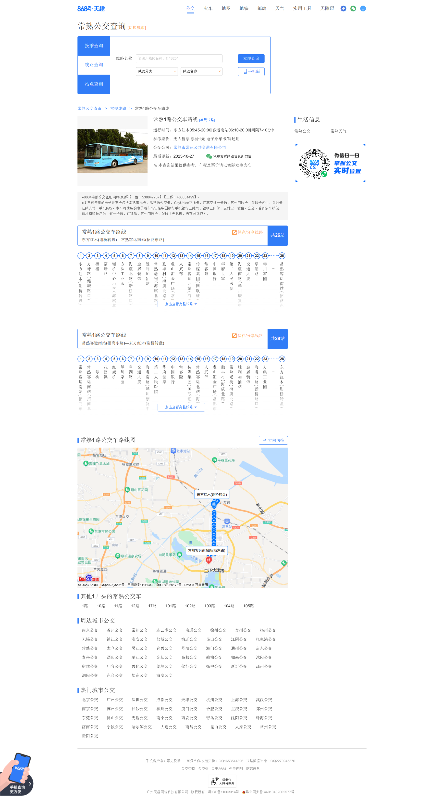
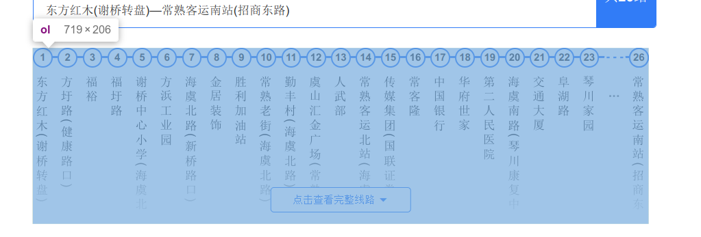
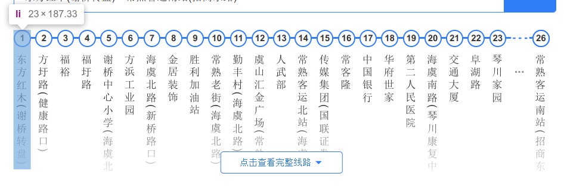

该脚本的参考链接如下：
[原文链接](https://blog.csdn.net/HenryAnChen/article/details/130811061)

本文爬取的网站：
[88684](https://changshu.8684.cn/)

---

这个脚本一共有两个代码文件，分别是 `script.py` 与 `` 。
`script.py` 为爬虫代码，用于爬取所有的公交车站台，需要修改代码中的 `城市名` 与`爬取类型` 。
爬取完会将每个公交车站台的名称保存到 `data/` 目录下，并命名为 `城市名.txt`

<br>

`script1.py` 为获取坐标的代码，用于搜索出所有的公交车站台的坐标。需要读取 `城市名.txt` 文件。
同时需要修改城市名，还需要高德地图的key，注意修改高德地图的key，否则无法使用。
并且高德的key每个人每天只有5000次的免费使用次数，所以请注意。
查询完以后，会将每个公交车站台的名称保存到 `data/` 目录下，命名为 `城市名.xls`。

# 1. 代码说明


## 1.1. 爬取标签说明

为了防止时间过长，导致界面大变样，在这边贴出了所有的界面元素，以便于后续的修改。

并且防止失效，我将原代码拷贝到了 `src/script/` 目录下，以下为原来的网页代码：
[界面一源代码](./常熟公交查询_常熟公交车线路查询_常熟公交地图%20-%20常熟公交网.html)

### 1.1.1. 界面一
界面一如下：


#### 1.1.1.1 bus-layer depth w120
代码中找到 `div` 标签的类名为 `bus-layer depth w120` 的元素，即下面的语句:
```
soup_buslayer = soup.find('div', class_='bus-layer depth w120')
```

主要是找到以下的元素：


#### 1.1.1.2. pl10

代码中找到 `div` 标签的类名为 `pl10` 的元素，即下面的语句:
```
soup_buslist = soup_buslayer.find_all('div', class_='pl10')
```

主要是找到以下的元素：


#### 1.1.1.3. kt
代码中获取所有的分类名称，即下面的语句:
```
name = soup_bus.find('span', class_='kt').get_text()
```

主要是找到以下的元素：


#### 1.1.1.4. list

找到 `div` 标签的类名为 `list` 的元素，即下面的语句:
```
soup_a_list = soup_bus.find('div', class_='list')
```
主要是找到以下的元素：


##### 1.1.1.4.1 a

`a`标签即上面的1~9

### 1.1.2. 界面二

当我们找到所有的以数字开头的公交车线路的地址以后，我们进入界面二。
[界面二源代码](常熟1字头公交车_常熟1字头公交线路%20-%20常熟公交查询.html)
界面二：


#### 1.1.2.1. list clearfix

找到 `div` 标签的类名为 `list` 的元素，即下面的语句:
```
soup_buslist = soup.find('div', class_='list clearfix')
```
主要是找到以下的元素：


##### 1.1.2.1.1. a

`a`标签即上面的每一路公交车

### 1.1.3. 界面三

当我们选择某一路公交车以后，进入界面三，我们就可以抓取每个公交车的站台信息了。
[界面三源代码](常熟1路_常熟1路公交车路线_常熟1路公交车路线查询_常熟1路公交车路线图.html)


#### 1.1.3.1. bus-lzlist mb15

找到 `div` 标签的类名为 `bus-lzlist mb15` 的元素，即下面的语句:
```
soup_buslayer1 = soup.find('div', class_='bus-lzlist mb15')
```

主要是找到以下的元素:


##### 1.1.3.1.1. ol 标签



###### 1.1.3.1.1.1 li标签



+ `a` 标签，即为上面的站台名