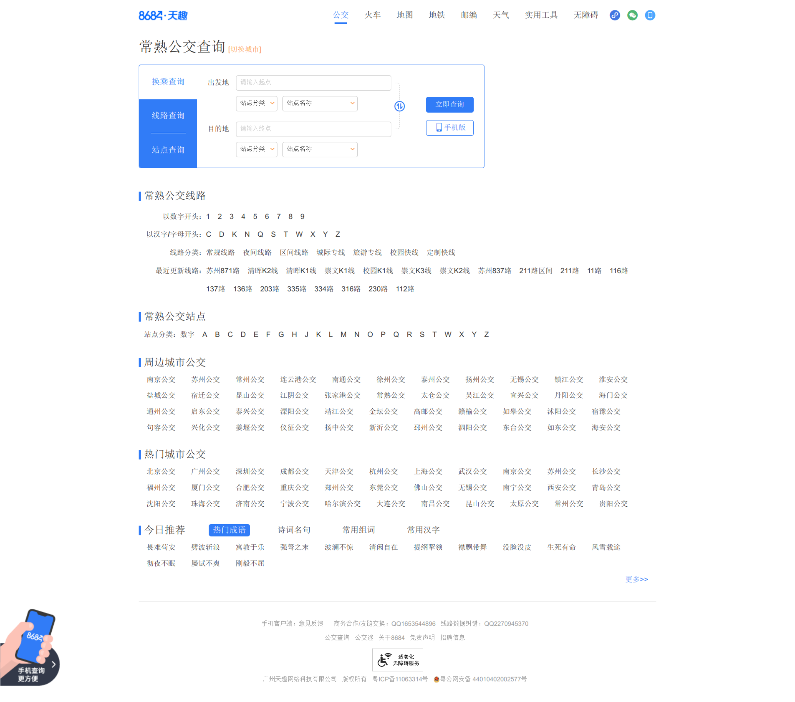

该脚本的参考链接如下：
[原文链接](https://blog.csdn.net/HenryAnChen/article/details/130811061)

本文爬取的网站：
[88684](https://changshu.8684.cn/)

---

# 1. 代码说明

## 1.1. 爬取标签说明

为了防止时间过长，导致界面大变样，在这边贴出了所有的界面元素，以便于后续的修改。

并且防止失效，我将原代码拷贝到了 `src/script/` 目录下，以下为原来的网页代码：
[源代码](./常熟公交查询_常熟公交车线路查询_常熟公交地图%20-%20常熟公交网.html)

原界面如下：


### 1.1.1. bus-layer depth w120
代码中找到 `div` 标签的类名为 `bus-layer depth w120` 的元素，即下面的语句:
```
soup_buslayer = soup.find('div', class_='bus-layer depth w120')
```

主要是找到以下的元素：


### 1.1.2. pl10

代码中找到 `div` 标签的类名为 `pl10` 的元素，即下面的语句:
```
soup_buslist = soup_buslayer.find_all('div', class_='pl10')
```

主要是找到以下的元素：


### 1.1.3. kt
代码中获取所有的分类名称，即下面的语句:
```
name = soup_bus.find('span', class_='kt').get_text()
```

主要是找到以下的元素：


### 1.1.4. list

找到 `div` 标签的类名为 `list` 的元素，即下面的语句:
```
soup_a_list = soup_bus.find('div', class_='list')
```
主要是找到以下的元素：


### 1.1.5. bus_i_t1

`a`标签即上面的1~9
